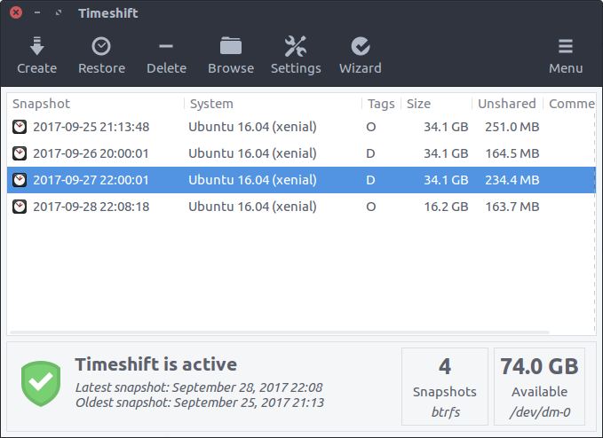
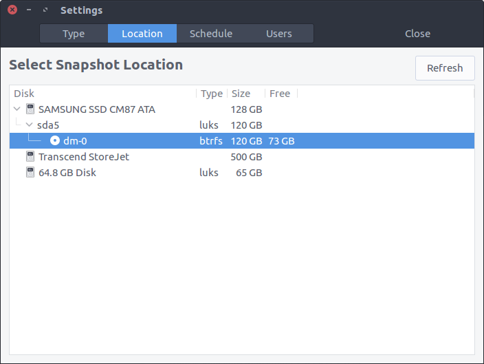
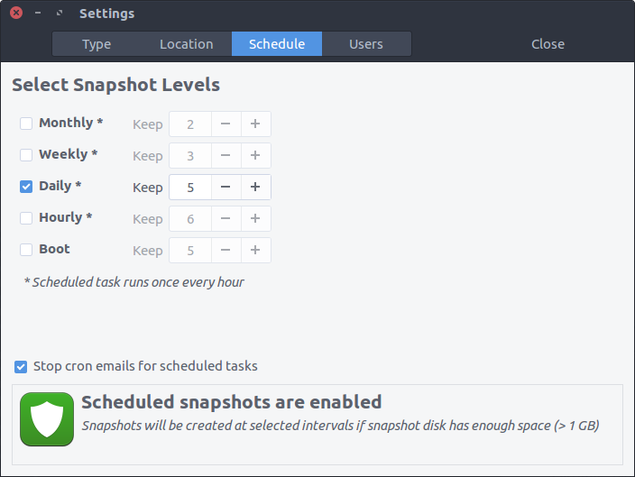
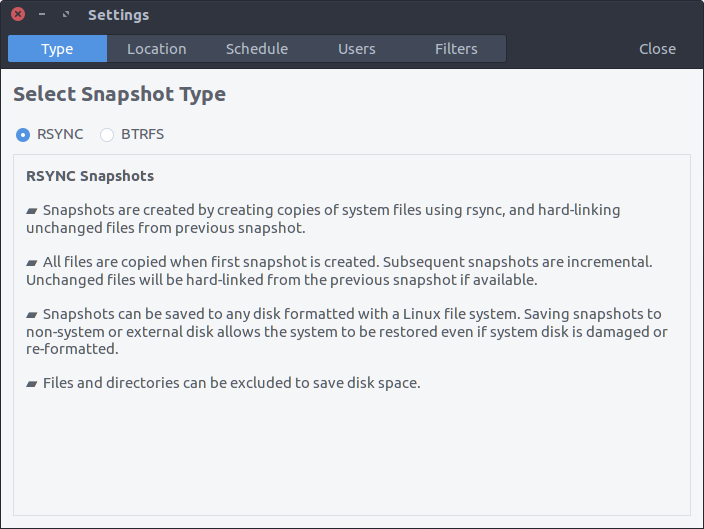
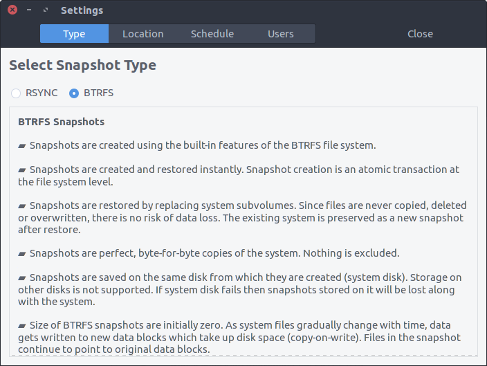
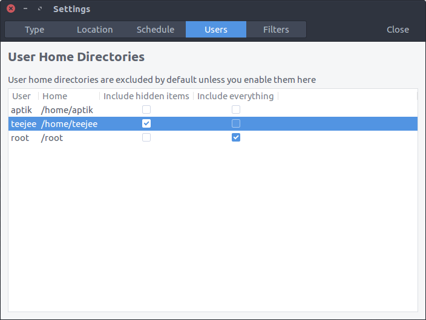
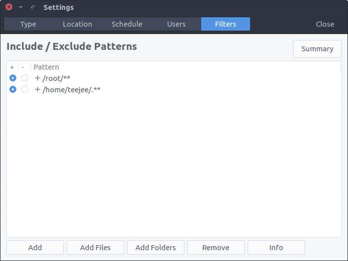
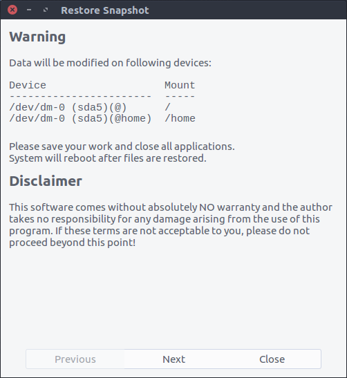

# Timeshift

Timeshift for Linux is an application that provides functionality similar to the _System Restore_ feature in Windows and the _Time Machine_ tool in Mac OS. Timeshift protects your system by taking incremental snapshots of the file system at regular intervals. These snapshots can be restored at a later date to undo all changes to the system. 

In RSYNC mode, snapshots are taken using [rsync](http://rsync.samba.org/) and [hard-links](http://en.wikipedia.org/wiki/Hard_link). Common files are shared between snapshots which saves disk space. Each snapshot is a full system backup that can be browsed with a file manager.

In BTRFS mode, snapshots are taken using the in-built features of the BTRFS filesystem. BTRFS snapshots are supported only on BTRFS systems having an Ubuntu-type subvolume layout (with @ and @home subvolumes).

Timeshift is similar to applications like [rsnapshot](http://www.rsnapshot.org/), [BackInTime](https://github.com/bit-team/backintime) and [TimeVault](https://wiki.ubuntu.com/TimeVault) but with different goals. It is designed to protect only system files and settings. User files such as documents, pictures and music are excluded. This ensures that your files remains unchanged when you restore your system to an earlier date. If you need a tool to backup your documents and files please take a look at the excellent [BackInTime](https://github.com/bit-team/backintime) application which is more configurable and provides options for saving user files.  



## Features

### Minimal Setup

*   Timeshift requires very little setup. Just install it, run it for the first time and take the first snapshot. Cron job can be enabled for taking automatic snapshots of the system at regular intervals. The backup levels can be selected from the _Settings_ window.

*   Snapshots are saved by default on the system (root) partition in path **/timeshift**. Other linux partitions can also be selected. For best results the snapshots should be saved to an external (non-system) partition.



### Multiple Snapshot Levels

*   Multiple levels of snapshots can be enabled - Hourly, Daily, Weekly, Monthly and Boot

*   Number of snapshots to retain can be specified for each level

*   Boot snapshots provide an additional level of backup and are created every time the system starts. Boot snapshots are deplayed by 10 mins so that system startup is not affected.



### Rsync & BTRFS Snapshots

* Supports rsync snapshots on all systems
* Supports BTRFS snapshots on BTRFS systems

  

  

### User Data is Excluded by Default
Timeshift is designed to protect system files and settings. It is NOT a backup tool and is not meant to protect user data. Entire contents of users' home directories are excluded by default. This has two advantages:

*   You don't need to worry about your documents getting overwritten when you restore a previous snapshot to recover the system.
*   Your music and video collection in your home directory will not waste space on the backup device.

You can selectively include items for backup from the ***Settings*** window. Selecting the option "*Include hidden items*" from the ***Users*** tab will backup and restore the .hidden files and directories in your home folder. These folders contain user-specific config files and can be included in snapshots if required.

*Note*: It is not recommended to include user data in backups as it will be overwritten when you restore the snapshot.




### Better Snapshots & Rotation

*   Unlike similar tools that are scheduled to take backups at a fixed time of the day, Timeshift is designed to run once every hour and take snapshots only when a snapshot is due. This is more suitable for desktop users who keep their laptops and desktops switched on for few hours daily. Scheduling snapshots at a fixed time on such users will result in missed backups since the system may not be running when the snapshot is scheduled to run. By running once every hour and creating snapshots when due, Timeshift ensures that backups are not missed.
*   Applications like rsnapshot rotate a snapshot to the next level by creating a hard-linked copy. Creating a hard-linked copy may seem like a good idea but it is still a waste of disk space, since only files can be hard-linked and not directories. The duplicated directory structure can take up as much as 100 MB of space. Timeshift avoids this wastage by using tags for maintaining backup levels. Each snapshot will have only one copy on disk and is tagged as "daily", "monthly", etc. The snapshot location will have a set of folders for each backup level ("Monthly", "Daily", etc) with symbolic links pointing to the actual snapshots tagged with the level.

### System Restore
* Snapshots can be restored by selecting a snapshot from the main window and clicking *Restore* button on the toolbar. 

* Snapshots can be restored either from the running system (online restore) or from another system that has Timeshift installed on it (offline restore). 

* If the main system is not bootable, then it is possible to boot from an Ubuntu Live CD, install Timeshift on the live system, and restore a snapshot on the main system.

* Restoring backups from the running system requires a reboot to complete the restore process.

  

### Cross-Distribution Restore

- You can also Timeshift across distributions. Let's say you are currently using Xubuntu and decide to try out Linux Mint. You install Linux Mint on your system and try it out for a week before deciding to go back to Xubuntu. Using Timeshift you can simply restore the last week's snapshot to get your Xubuntu system back. Timeshift will take care of things like reinstalling the bootloader and other details. 
- Since installing a new linux distribution also formats your root partition you need to save your snapshots on a separate linux partition for this to work.
- It is recommended to include hidden items in home directory by selecting the option "*Include  Hidden Items*" from *Settings* > *Users*.

## Supported System Configurations

- **Normal** - OS installed on non-encrypted partitions

- **LUKS Encrypted** - OS installed on LUKS-encrypted partitions

- **LVM2** - OS installed on LVM2 volumes (with or without LUKS)

- **BTRFS** - OS installed on BTRFS volumes (with or without LUKS)

  - Only Ubuntu-type layouts with **@** and **@home** subvolumes are supported
  - **@** and **@home** subvolumes may be on same or different BTRFS volumes
  - **@** may be on BTRFS volume and **/home** may be mounted on non-BTRFS partition
  - Other layouts are not supported

- **GRUB2** - Bootloader must be GRUB2. GRUB legacy and other bootloaders are not supported.

- **EFI** - EFI systems are supported. Make sure that ```/boot/efi``` partition is selected for mounting before restoring snapshots (application will do it automatically).


- **Encrypted Home** - For users with encrypted home, files in ```/home/.ecryptfs/$USER``` will be backed-up and restored. The decrypted contents in ```$HOME``` will be excluded. This avoids the security risk of decrypted contents becoming available outside the user's home directory.
- **Encrypted Private Directory** - For users with encrypted *Private* directory, the encrypted files in ```$HOME/.Private```, as well as the decrypted files in ```$HOME/Private```, will be excluded (as it contains user data). Filters added by user to include files from ```$HOME/.Private``` or ```$HOME/Private``` will be ignored.
- **Docker & Containers** - Docker and containerized systems are not supported. Running Timeshift on such systems will have unpredictable results.

## Installation

#### Ubuntu-based Distributions

Ubuntu, Linux Mint, Elementary OS, etc.

Packages are available in the Launchpad PPA for supported Ubuntu releases.
Run the following commands in a terminal window:  

```sh
sudo add-apt-repository -y ppa:teejee2008/ppa
sudo apt-get update
sudo apt-get install timeshift
```

DEB and RUN packages are available on [Releases](https://github.com/teejee2008/Timeshift/releases) page for older Ubuntu releases which have reached end-of-life.

#### Other Linux Distributions

Download the .RUN installer from [Releases](https://github.com/teejee2008/Timeshift/releases) page and execute it in a terminal window: 

```sh
sudo sh ./timeshift*amd64.run # 64-bit
sudo sh ./timeshift*i386.run  # 32-bit
```

Installer can be used on the following distribution types:

- **RedHat** based - Fedora, RedHat, Cent OS, etc (supports **dnf** and **yum**)
- **Debian** based - Debian, Ubuntu, Linux Mint, Elementary OS, etc (supports **apt**)
- **Arch** based - Arch Linux, Manjaro, etc (supports **pacman**)

## UnInstall

Run the following command in a terminal window:  

    sudo apt-get remove timeshift

or  

    sudo timeshift-uninstall

Remember to delete all snapshots before un-installing. Otherwise the snapshots continue to occupy space on your system.  To delete all snapshots, run the application, select all snapshots from the list (CTRL+A) and click the _Delete_ button on the toolbar. This will delete all snapshots and remove the _/timeshift_ folder in the root directory.     

If you used the installer to install Timeshift, you can remove the installed files with following command:  

    sudo timeshift-uninstall

## Known Issues & Limitations

#### BTRFS volumes
BTRFS volumes must have an Ubuntu-type layout with **@** and **@home** subvolumes. Other layouts are not supported. Systems having the **@** subvolume and having **/home** on a non-BTRFS partition are also supported.
#### Disk Space
Timeshift requires a lot of disk space to keep snapshot data. The device selected as snapshot device must have sufficient free space to store the snapshots that will be created. 

If the backup device is running out of space, try the following steps:  

*   Reduce the number of backup levels - Uncheck the backup levels and keep only one selected
*   Reduce the number of snapshots that are kept - In the _Schedule_ tab set the number of snapshots to 5 or less.
*   You can also disable scheduled snapshots completely and create snapshots manually when required

#### Bootloader & EFI
* Only those systems are supported which use GRUB2 bootloader. Trying to create and restore snapshots on a system using older versions of GRUB will result in a non-bootable system.  
* EFI systems are fully supported. Ensure that the ***/boot/efi*** partition is mapped while restoring a snapshot. It will be mapped automatically if detected.

## Disclaimer

This program is free for personal and commercial use and comes with absolutely no warranty. You use this program entirely at your own risk. The author will not be liable for any damages arising from the use of this program. This program is distributed in the hope that it will be useful, but WITHOUT ANY WARRANTY; without even the implied warranty of MERCHANTABILITY or FITNESS FOR A PARTICULAR PURPOSE. See the GNU General Public License for more details.   

## Contribute

You can contribute to this project in various ways:

- Submitting ideas, and reporting issues in the [tracker](https://github.com/teejee2008/timeshift/issues)
- [Translating](https://translations.launchpad.net/linuxmint/latest/+pots/timeshift) this application to other languages
- Contributing code changes by fixing issues and submitting a pull request
- Making a donation via PayPal or bitcoin, or signing-up as a patron on Patreon

## Donate

*Timeshift* is a non-commercial application. I work on it during my free time based on my requirements and interest. If you wish to support this project, you can make a donation for $10 or more via PayPal. Your contributions will help keep the project alive and support future development.

**PayPal** ~ If you find this application useful and wish to say thanks, you can buy me a coffee by making a donation with Paypal.

[](https://www.paypal.com/cgi-bin/webscr?business=teejeetech@gmail.com&cmd=_xclick&currency_code=USD&amount=10&item_name=Timeshift%20Donation)  

**Patreon** ~ You can also sign up as a sponsor on [Patreon.com](https://www.patreon.com/teejeetech). As a patron you will get access to beta releases of new applications that I'm working on. You will also get news and updates about new features that are not published elsewhere.

[](https://www.patreon.com/bePatron?u=3059450)

**Bitcoin** ~ You can send bitcoins at this address or by scanning the QR code below:

```1KdEyJjkuEW8aZWjenf4x5uEeHo9VTYqio```

